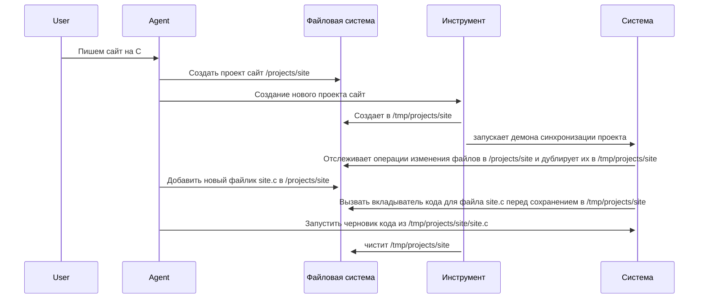

# Definition

ИНСТРУМЕНТ:

    у него есть права в файловой системе на CRUD для файлов
    - create (путь для чистовика): он создает новый проект с локальным git-ом под названием черновик
        по пути: ~/путь_для_чистовика/черновик/
    - CRUD:
       - для любого переданного буффера мы смотрим на тип файла
            для типа файла Х:
                мы выполняем код обертывания перед сохранением 
                    пример:
       - на каждую новую операцию он делает небольшой коммит в этом гите
    - execute: вызывает произвольную команду порождая новый процесс через process.execute
        - пишет в debug.info stdout
    - finish
        -  для ~/путь_для_чистовика/черновик/** синхрозируй все в ~/путь_для_чистовика/чистовик

## system design

